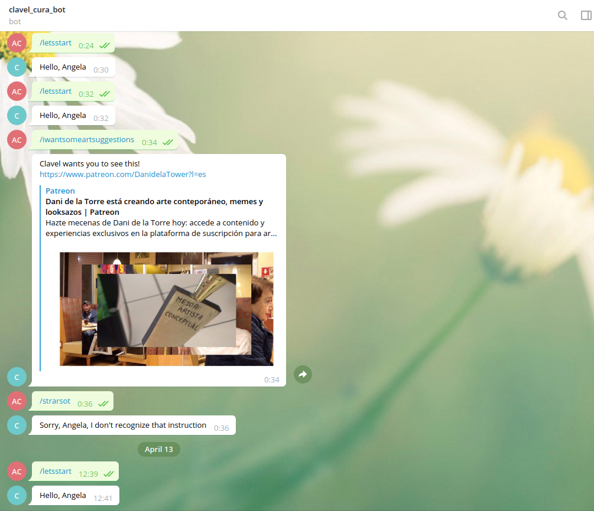

# Telegram-art-bot
> This is a Telegram-art-bot made to curate contemporary art base and art tendencies. This bot will help you access references of an art curator 




## Built With

- Ruby
- Linters
- RSpec

## Live Demo

[Live Demo Link] (n/a)

## Getting Started

**In order to set up the project locally, you just need to run bundle install to install the required gems on your computer.**


To get a local copy up and running follow these simple example steps.

- Clone the repository with the following command: git clone

### Prerequisites

- Ruby Install
- RSpec Install
- A Telegram account 

### Setup

- Run bundle install to install the required gems on your computer

### Install

- Click on the "code" button above on this page and copy the link to the repository
- Open a terminal (CTRL + ALT + T), type git clone and paste the link you copied in the previous step, then hit Enter Ex: ‘git clone https://github.com/angelacuahutle/Telegram-art-bot’
- Search for the appropriate token
- Set the functionalities with ruby 

Ready to run!

### Usage

- Search clave_cura_bot
- Use the comand ```/letsstart```
- Then request the bot ```/iwantsomeartsuggestions```
- The bot returns random and cool art! 
- Want to see more? Use the command again ```/iwantsomeartsuggestions```
- Say hello again by using the command!! ```/letsstart```

### Run tests

- In order to make a test run the command 

```ruby
rspec spec/bot_test.rb
```

👤 **Author**

- GitHub: [@angelacuahutle](https://github.com/angelacuahutle)
- Twitter: [@AngelaCunaDev](https://twitter.com/AngelaCunaDev)
- LinkedIn: [https://www.linkedin.com/in/angela-cuahutle/](https://www.linkedin.com/in/angela-cuahutle/)

## 🤝 Contributing

Contributions, issues, and feature requests are welcome!

Feel free to check the [issues page](../../issues/).

## Show your support

Give a ⭐️ if you like this project!

## 📝 License

This project is [MIT](./MIT.md) licensed.
